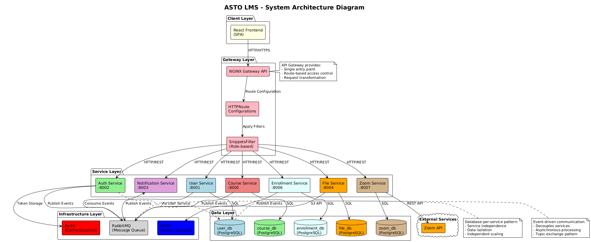

# ASTO LMS

A learning management system built as a distributed, event-driven microservices system — 7 independent Go services behind a Kubernetes Gateway API, communicating asynchronously over RabbitMQ, with a React/TypeScript frontend.



## What it does

ASTO LMS handles course delivery end-to-end: user auth and registration, course/section/module management, student enrollment, file storage for course materials, live sessions via Zoom integration, and notifications — with role-based access for admins, instructors, and students.

## Why microservices

This was built specifically to learn and demonstrate distributed-systems patterns beyond a typical monolith: independent service boundaries with their own databases, asynchronous cross-service communication instead of tight coupling, and infrastructure-level routing/authorization rather than handling it inside application code.

## Architecture

| Service                | Responsibility                                                                |
| ---------------------- | ----------------------------------------------------------------------------- |
| `auth-service`         | Registration, login, JWT issuance/refresh, email verification, password reset |
| `user-service`         | User profiles and account data                                                |
| `course-service`       | Courses, sections, modules, categories                                        |
| `enrollment-service`   | Student enrollment and course access                                          |
| `file-service`         | Course material storage (MinIO-backed)                                        |
| `zoom-service`         | Live session scheduling via Zoom integration                                  |
| `notification-service` | Cross-service notifications                                                   |

**Cross-service communication:** services don't call each other directly for state changes. Instead they publish and consume domain events over RabbitMQ — for example, `course-service` consumes `UserUpdated` and `ZoomMeetingCreated` events rather than querying `user-service`/`zoom-service` synchronously. This keeps services independently deployable and avoids cascading failures when one service is degraded.

**Data ownership:** each service owns its own PostgreSQL database (`course_db`, `enrollment_db`, `file_db`, `user_db`, `zoom_db`) — no shared database, no cross-service joins.

**Routing & access control:** a Kubernetes Gateway API (NGINX Gateway Controller) handles ingress routing and enforces role-based access at the infrastructure layer — separate route/policy manifests exist per role (admin, instructor, student, public) per service, rather than every service reimplementing authorization middleware.

**Infrastructure:** Redis for caching, MinIO for object storage, RabbitMQ for messaging — each run as Kubernetes operators (Redis Operator, MinIO Operator, RabbitMQ Cluster Operator) rather than manually managed instances.

## Tech Stack

- **Backend:** Go, Gin, JWT auth, zap structured logging, Swagger/OpenAPI docs per service
- **Frontend:** React, TypeScript
- **Messaging:** RabbitMQ (event-driven pub/sub between services)
- **Data:** PostgreSQL (per-service), Redis, MinIO (object storage)
- **Infra:** Kubernetes, Gateway API, Docker, Helm, Kubernetes Operators (Redis, MinIO, RabbitMQ)
- **Architecture pattern:** hexagonal/clean architecture per service (`application/usecases`, `infrastructure`, `interfaces/http`)
- **Testing:** unit tests and integration tests per service

## Getting Started

Full deployment instructions (Minikube/production Kubernetes setup, operator installation, building images, deploying, troubleshooting) are in [DEPLOYMENT.md](./DEPLOYMENT.md).

## Project Structure

```
backend/
  services/          # 7 independent Go microservices, each with its own go.mod
  shared/            # shared packages (messaging, logger, persistence, events)
  manifests/          # Kubernetes manifests (gateway routes/policies, databases, infra)
frontend/            # React + TypeScript client
```
